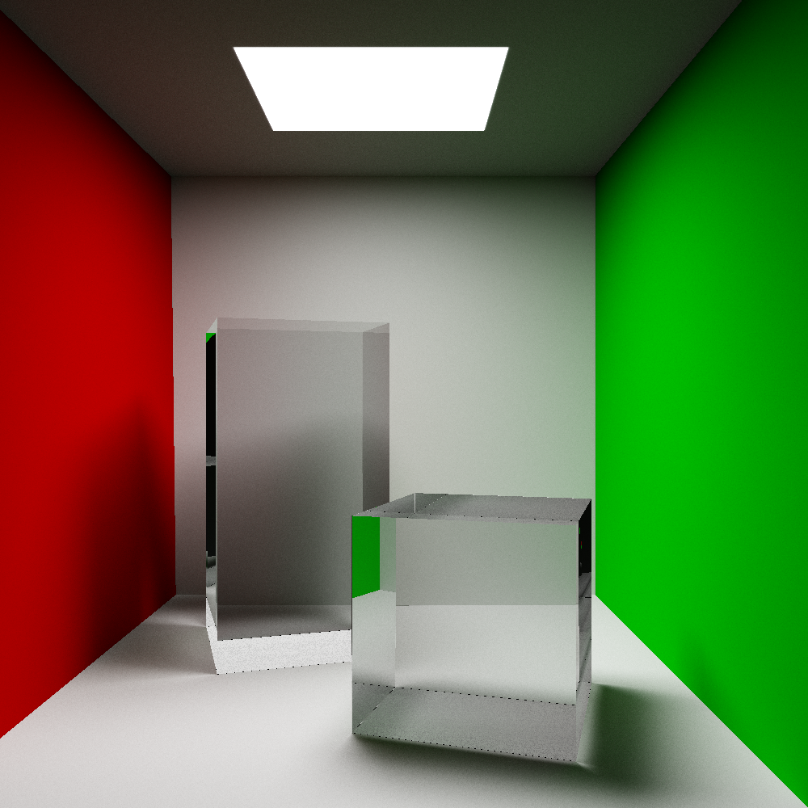
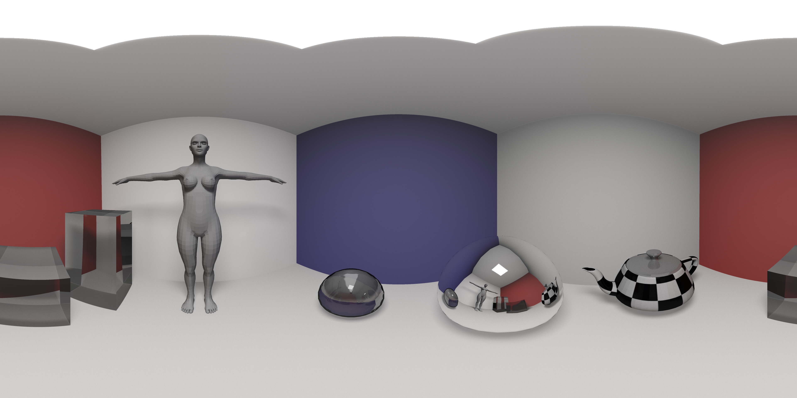
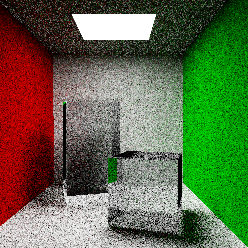
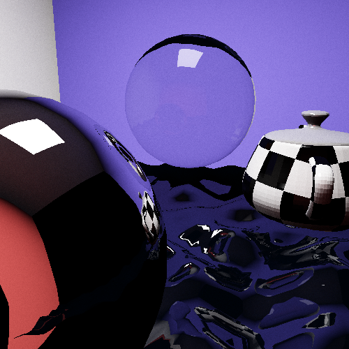
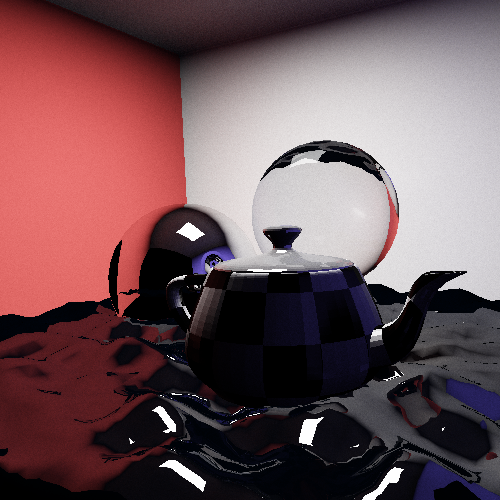
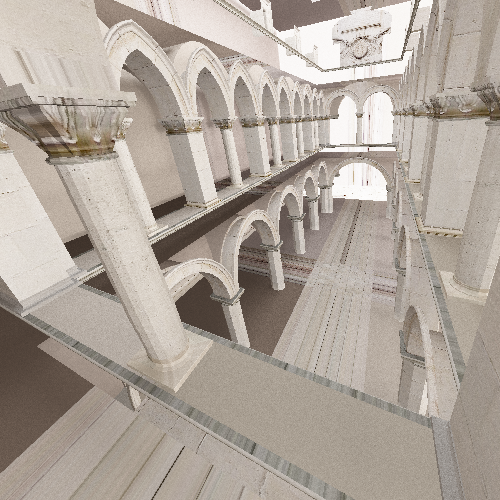
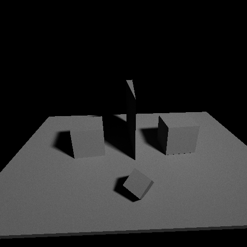
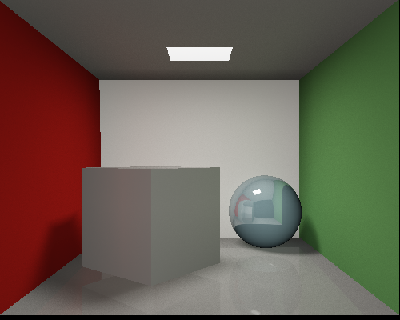
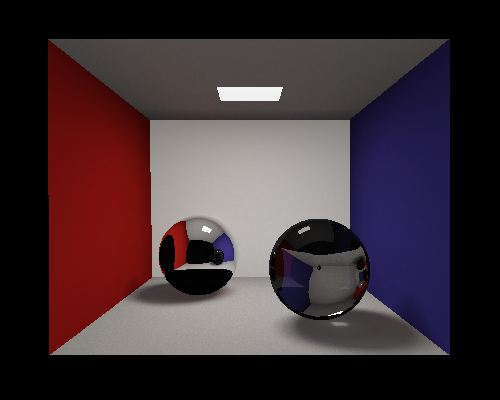
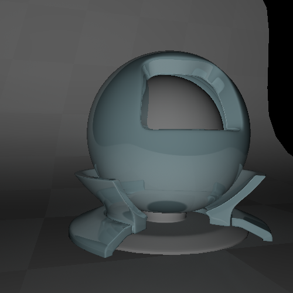

# hpTracing





`hpTracing`是一个基于OpenCL的全局光照渲染程序，使用蒙特卡罗光线追踪（Monte Carlo path tracing），主要特点有：

- 实时的渲染和显示，通过键盘调整视角和位置等；也可以输出至图片文件
- 支持输入Wavefront OBJ格式的文件
- 使用SAH KD-Tree加速
- 支持所有光照效果：漫反射、镜面反射、折射（全反射）、环境光等
- 支持纹理映射
- 支持VR全景图片生成，可以在Samsung Gear VR等设备上观看
- 等等……

## 编译和运行

本程序在Intel HD 5000 (Mac OS X)和Nvidia Tesla K20m (Linux)环境下编译运行通过，也应该能在其他所有支持OpenCL 1.1版本以上的显卡和系统上运行。

运行命令为：

```
./hptracing -i input.obj [OPTIONS]
```

主要参数说明（完整的参数请运行`./hptracing -h`）：

- `-i input.obj`：指定输入的Wavefront OBJ格式文件；相应的`.mtl`文件应在当前路径下
- `--width, --height`：设置输出图片的长和宽，默认为500x500
- `--view, --up, --right, --angle`：设置视角和位置
- `-x`：使用超采样来抗锯齿
- `-s`：每个像素点的采样次数
- `-d`：最大迭代深度
- `-o`：输出图片文件。若不指定则进入GUI模式

GUI模式下，键盘操作说明：

- `w/a/s/d/q/e`：视角旋转
- `上下左右/j/k`：移动
- `＋/-`：放大缩小
- `[/]`：改变移动的步长
- `ESC`：退出

## 结果样例

GUI操作视频见`records.mov`，可以看到实时的视角变换。为了能够实时渲染，该样例中采样率很低且追踪深度较小，包含躁点较多。以下是一些非实时渲染的结果（运行时间在Nvidia Tesla K20m上测得）。

经典的Cornell box场景，5000次采样（本文开头的图片为10000次采样的结果），渲染时间1350秒。可以注意到真实的折射（注意左边方块后方的折射光线效果）、全反射、软阴影、漫反射（注意天花板）效果。


低采样版本（运行时间**4秒**）：



复杂的Cornell box场景，5000次采样，渲染时间2000秒。可以注意到复杂的表面（球形、水面由大量三角形构成）、镜面反射（左边的球）、纹理（茶壶上的纹理为真实的图片纹理）。





更复杂的场景：1000次采样，渲染时间1663秒，可以注意到纹理、光线和软阴影效果。



更多场景：










## 具体实现

### 光线追踪算法

对于一个物理场景，真实的渲染模型应该是：对于物体上的每一个点，其进入人眼的光线等于以下几部分光线贡献的总和：

- 该点自身发出的光线（如果该物体是光源）
- 该点反射的各个方向的所有光线（包括漫反射和镜面反射和全反射）
- 该点折射出来的光线（如果该物体是透明的）

其中，一个物体反射和折射的光线由其他物体产生，是一个递归过程。其中，折射只有一个方向，而反射需要计算所有方向射入该点的光线，计算量巨大。蒙特卡罗法在反射方向中每次随机选取一个方向进行递归，次数越多越接近真实情况。另外，由于光源对反射光线的贡献占了绝大多数，程序还对光源进行了单独的采样来加快速度。对于每一次递归，也使用随机的方式，根据该物体折射、反射的强度随机选择折射、漫反射、镜面反射之一进行递归。

### OpenCL上的算法实现和优化

GPU相当于一个数据宽度非常宽的SIMD处理器，即多个运算单元共享同一个PC等。因此在编写OpenCL程序时应该尽量防止多个运算单元进入程序的不同分支。另外，为了提高GPU的并行性和减弱访存延时的影响，每一个OpenCL kernel应该尽可能的短小。另外，OpenCL kernel不允许递归。

根据这些OpenCL的特点，在程序中定义一个包含单个交点信息的数据结构，每一个计算单元能够在这个数据结构上单独进行计算。在OpenCL上的光线追踪算法伪代码如下：

```
typedef struct {
    View ray
    Intersection point
    Intersection material
    Intersection point normal
    Reflect direction
    Refract direction
    result
} unit

vector<unit> data := primary rays

LOOP MAX_DEPTH:
    opencl_compute_all_intersect(data)
    opencl_compute_self_emission(data)
    opencl_compute_normal(data)
    opencl_get_next_direction(data)
```

即每一个OpenCL kernel对大量光线进行同一个操作，比如计算法向量等，来提高并行度。另外值得一提的是，计算完交点后，并不是所有的数据都需要进行下一次计算，会造成大量资源浪费，中间需要对数据进行`compact`，详见代码。

### KD-Tree在OpenCL上的实现

程序中使用了SAH KD-Tree加速求交过程，能够支持包含大量三角面的场景。OpenCL由于不支持递归（也无法动态分配内存来使用栈或队列），对二叉树的遍历无法使用常规方法实现。本程序中，对于每个二叉树的节点，额外记录了其兄弟节点的位置，使得能够在一个循环中完成对二叉树的遍历。

KD-Tree的构建过程由于整个运行过程只需要运行一次，本程序中在CPU上实现，使用了SAH算法得到最优的KD-Tree分割。对于每一个节点，SAH算法能够给出最优的分割位置，通过计算不分割的cost

$$COST_{no-split} = C_i * N_0$$

和每一个分割点的cost

$$COST_{split} = C_t + C_i * {N_{left} * \frac{A_{left}}{A_0} + N_{right} * \frac{A_{right}}{A_0}}$$

其中$C_t$和$C_i$分别代表判断一次六面体相交和判断一次三角形相交的代价，$N$表示包含的三角形数量，$A$表示六面体的体积。由此来找到最优的风格位置（或者不分割）。

### 法向量和纹理映射的计算

OBJ文件会提供每个顶点的法向量，对于曲面物体，一个三角形内部点的法向量应该通过其三个定点的法向量来计算而不是根据三角形本身计算。将三角形内部的该点P与ABC三个顶点相连构成三个三角形，则该点的法向量计算方法为：

$$ N_P = \frac{N_A * A_{PBC} + N_B * A_{PAC} + N_C * A_{PAB}}{A_{ABC}} $$

其中$A$表示三角形的面积。相应的，该点的纹理映射坐标也类似的根据ABC三点的纹理映射坐标确定。


## 参考文献

- "Stackless KD-Tree Traversal for High Performance GPU Ray Tracing"", Stefan Popov et al, Eurographics 2007
- "The OpenCL Programming Book", Ryoji Tsuchiyama et al, Fixstars
- [SAH Kd Trees](https://graphics.cg.uni-saarland.de/fileadmin/cguds/courses/ws1011/cg1/rc/Garrido_web/project/sahkdtree.html)
- [WaveFront Material (.mtl) File Format](http://www.fileformat.info/format/material/)

另外，本程序中使用了以下库：

- [tinyobjloader](https://github.com/syoyo/tinyobjloader)用于读取OBJ文件
- [CImg](http://cimg.sourceforge.net)用于读写图片文件
- [OptionParser](https://github.com/weisslj/cpp-argparse/)用于解析命令行参数
- [Eigen](http://eigen.tuxfamily.org/dox/group__TutorialMatrixArithmetic.html)用于矩阵运算

另外，样例中的场景来自于[McGuire Graphics Data](http://graphics.cs.williams.edu/data/meshes.xml)
